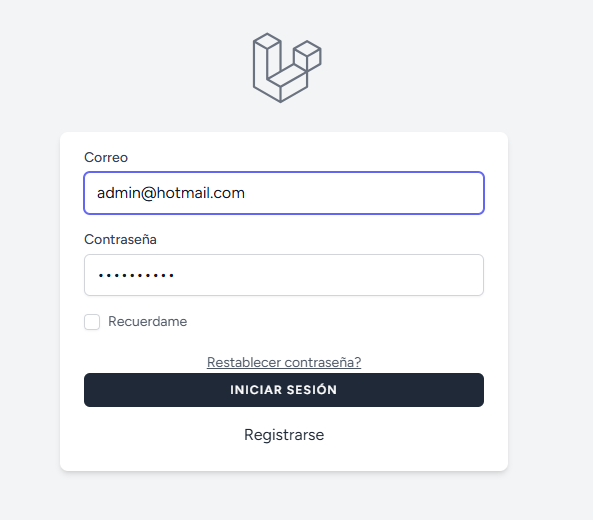
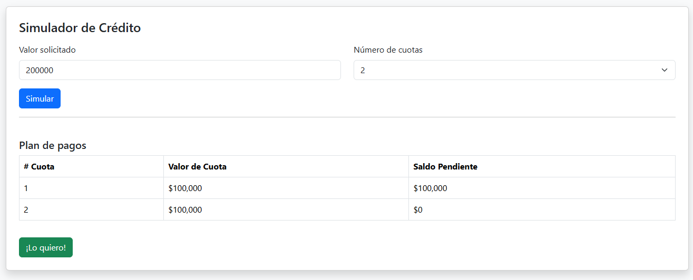
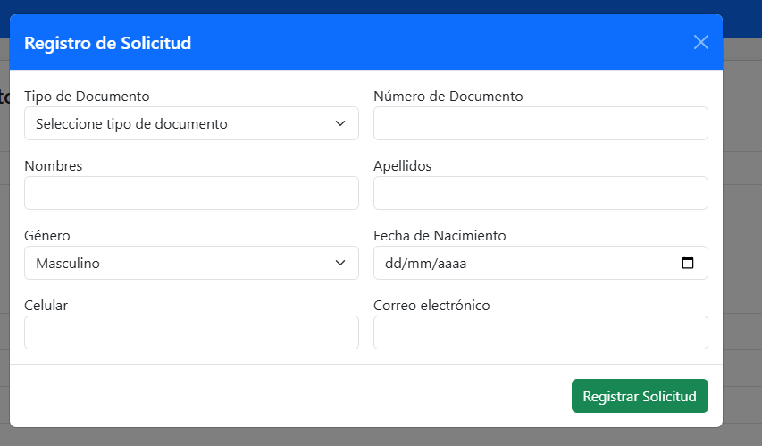
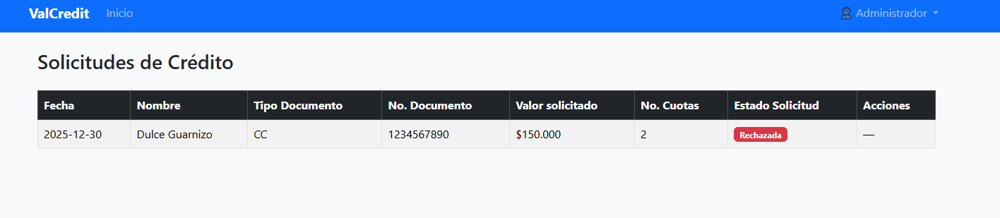

# Simulador de Crédito - Prueba Técnica

## Arquitectura y Funcionamiento del Proyecto Laravel “Credit Simulator”
1. Introducción

Este proyecto está desarrollado con el framework Laravel, utilizando principalmente el patrón arquitectónico MVC (Modelo-Vista-Controlador) junto con una API REST para manejar las operaciones del simulador y las solicitudes de crédito. La aplicación permite a usuarios normales simular créditos y registrar solicitudes, mientras que los administradores gestionan estas solicitudes a través de un panel administrativo.

2. Estructura General
2.1. Modelo-Vista-Controlador (MVC)

Modelos (app/Models)
Representan las entidades de negocio, como Clientes (Customer), Solicitudes de Crédito (LoanRequest) y Estados de Solicitud (LoanStatus).
Se encargan de la lógica relacionada con los datos y las relaciones entre tablas.

Vistas (resources/views)
Son las plantillas Blade que generan la interfaz HTML visible para el usuario. Incluyen vistas para el simulador, registro de solicitudes y el panel administrativo.

Controladores (app/Http/Controllers)
Son la capa que recibe las solicitudes HTTP, ejecuta la lógica, interactúa con los modelos y retorna las respuestas (HTML o JSON).
Ejemplos:

PublicController para las vistas accesibles a usuarios normales.

AdminController para funcionalidades administrativas.

Controladores específicos para entidades, como LoanRequestController (API).

2.2. API REST (app/Http/Controllers/Api)

La aplicación expone endpoints RESTful para funcionalidades clave.

Permite que el frontend (JavaScript con Fetch API) realice solicitudes AJAX para simular créditos y registrar solicitudes sin recargar la página.

Las rutas de API están definidas en routes/api.php.

2.3. Middleware y Seguridad

Autenticación: Se usa middleware auth para proteger rutas que requieren usuario autenticado.

Roles: Middleware admin protege las rutas de administración. Solo usuarios con rol admin acceden al panel.

Redirección basada en roles: Tras login, se redirige a /admin/dashboard o al simulador según el rol.

2.4. Frontend: Blade + JavaScript

Se usa Blade para renderizar páginas con componentes reutilizables.

JavaScript (en public/js/simulator.js) utiliza Fetch API para llamar a endpoints API y actualizar la interfaz dinámicamente.

SweetAlert2 y otras librerías pueden usarse para mejorar la experiencia de usuario.

3. Flujo de Funcionamiento (Usuario Normal)

El usuario accede al simulador (vista pública o dashboard).

Realiza una simulación enviando datos al endpoint API /api/simulate.

El backend responde con el plan de cuotas, que se muestra dinámicamente.

El usuario puede registrar una solicitud enviando un POST a /api/loan-requests.

El sistema valida y almacena la solicitud.

El usuario ve confirmación sin salir de la página.

4. Flujo de Funcionamiento (Administrador)

El administrador inicia sesión y es redirigido al panel administrativo.

Visualiza todas las solicitudes de crédito con detalles y estado.

Puede aprobar o rechazar solicitudes con botones que envían POST a rutas protegidas.

El panel muestra confirmaciones y actualiza la lista.

5. Diagrama Esquemático (Simple)
Usuario Normal
  │
  ▼
[Frontend Blade + JS]
  │ (Fetch API)
  ▼
[API REST - LoanRequestController / SimulatorController]
  │
  ▼
[Modelos: LoanRequest, Customer, LoanStatus, DocumentType]
  │
  ▼
[Base de Datos]

Administrador
  │
  ▼
[Frontend Blade - Panel Admin]
  │ (Form POST)
  ▼
[AdminController]
  │
  ▼
[Modelos]
  │
  ▼
[Base de Datos]

6. Resumen

Arquitectura MVC con separación clara de responsabilidades.

API REST para operaciones asincrónicas y mejor experiencia UX.

Middleware para proteger rutas y gestionar roles.

Frontend combina Blade y JavaScript para interactividad.

Roles diferenciados para usuarios normales y administradores.

### Login


### Simulador


### Simulador


### Solicitudes



## El proyecto incluye:

- Simulador de crédito (pantalla pública)
- Registro de solicitudes de préstamo
- Plan de pagos automático
- Consola administrativa para aprobar/rechazar solicitudes
- API RESTful para operaciones backend

---

## Tecnologías

- **Backend:** PHP 8.2 / Laravel 12.x
- **Base de datos:** MySQL / MariaDB
- **Frontend:** Blade, Bootstrap 5, jQuery
- **Autenticación:** Laravel Breeze / Fortify
- **Control de versiones:** Git

---

## 🚀 Instalación Local

### 1️⃣ Clonar repositorio
```bash
git clone https://github.com/Godie84/simulador_credito.git
cd simulador_credito
```
2️⃣ Instalar dependencias
```bash
composer install
npm install
npm run dev
```
3️⃣ Configurar entorno
Copia el archivo .env.example a .env y ajusta tu conexión de base de datos:

dotenv
Copiar código
DB_CONNECTION=mysql
DB_HOST=127.0.0.1
DB_PORT=3306
DB_DATABASE=simulador_credito
DB_USERNAME=root
DB_PASSWORD=

4️⃣ Generar clave de aplicación
```bash
php artisan key:generate
```
5️⃣ Migrar y seedear base de datos

php artisan migrate:fresh --seed
Esto crea todas las tablas y carga:

Usuario admin:
Email: admin@hotmail.com
Password: 1234567890

Estados de préstamos: pendiente, aprobada, rechazada

⚙️ Uso
1️⃣ Acceso a la aplicación
Abrir en el navegador: http://127.0.0.1:8000

Página pública: simulador de crédito

2️⃣ Simulación de crédito
Ingresar valor solicitado y número de cuotas

Se mostrará el plan de pagos con:

Número de cuota
Valor de cuota
Saldo pendiente

Presionar ¡Lo quiero! para registrar la solicitud

3️⃣ Registro de solicitud

Completar formulario con datos personales

Validaciones frontend y backend:
Edad mínima 18 años
Email válido
Celular entre 10 y 13 dígitos

Al enviar, se muestra mensaje de confirmación

4️⃣ Consola administrativa
URL: /admin (requiere login)

Usuario admin: admin@hotmail.com / 1234567890

Funcionalidades:

- Listar solicitudes registradas
- Aprobar / Rechazar solicitudes
- Estado reflejado en base de datos

API Endpoints
Método	Ruta	Descripción
GET	/api/simulate	Simular plan de pagos
POST	/loan-requests	Registrar nueva solicitud
GET	/loan-requests	Listar solicitudes
PUT	/loan-requests/{id}/approve	Aprobar solicitud
PUT	/loan-requests/{id}/reject	Rechazar solicitud

Validaciones principales

- Valor solicitado: 100.000 a 100.000.000
- Número de cuotas: 2 a 24
- Edad mínima: 18 años
- Celular: 10-13 dígitos
- Email: formato válido

Notas
- La contraseña del usuario admin está encriptada correctamente
- El proyecto usa Laravel Breeze/Fortify para autenticación
- Las solicitudes se manejan mediante relaciones Eloquent:
- LoanRequest → Customer
- LoanRequest → LoanStatus

Ejecutar servidor local
```bash
php artisan serve
Luego abrir: http://127.0.0.1:8000
```

🧾 Script SQL de creación de tablas
Puedes generar el SQL desde las migraciones:

```bash
php artisan migrate:status
php artisan migrate:generate
```


<p align="center"><a href="https://laravel.com" target="_blank"></a></p>

<p align="center">
<a href="https://github.com/laravel/framework/actions"></a>
<a href="https://packagist.org/packages/laravel/framework"></a>
<a href="https://packagist.org/packages/laravel/framework"></a>
<a href="https://packagist.org/packages/laravel/framework"></a>
</p>
